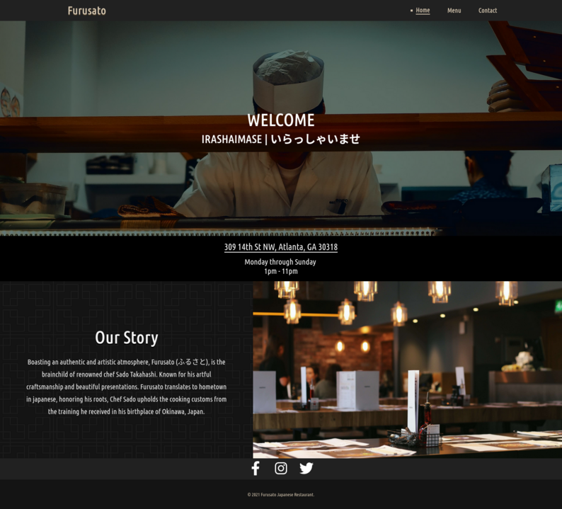

# Furusato

## Atlanta's hottest, new, non-existent, sushi resturant.

  

## What is this?

This is a website for a fictional resturant with the aim being:

* To build a multi-page website using mainly js to dynamically create all page elements
* Use WebPack to bundle the files
 
## What did you use for the project?

* Html
* Css
* Vanilla Javascript

## Got a Demo?  

Of course! The live demo can be found [here](https://cr-booker.github.io/Furusato-restaurant/)

## How do i get started working on this?
Feel like doing some tinkering? Getting setup is super easy.  

1. Clone this project  
   `https://github.com/syst3m-failur3/Furusato-restaurant-page.git`

1. Ok great you cloned the project, kudos! Now we gotta install the requred dependecies using:  
   `npm install`

1. Finally, to get the bundled files for distrubution we just run:  
   `npm run build`

## License

This project is made available under the GNU General Public License v3 (GPLv3)  
Click [here](https://github.com/cr-booker/Furusato-restaurant/blob/main/LICENSE) for more details.
